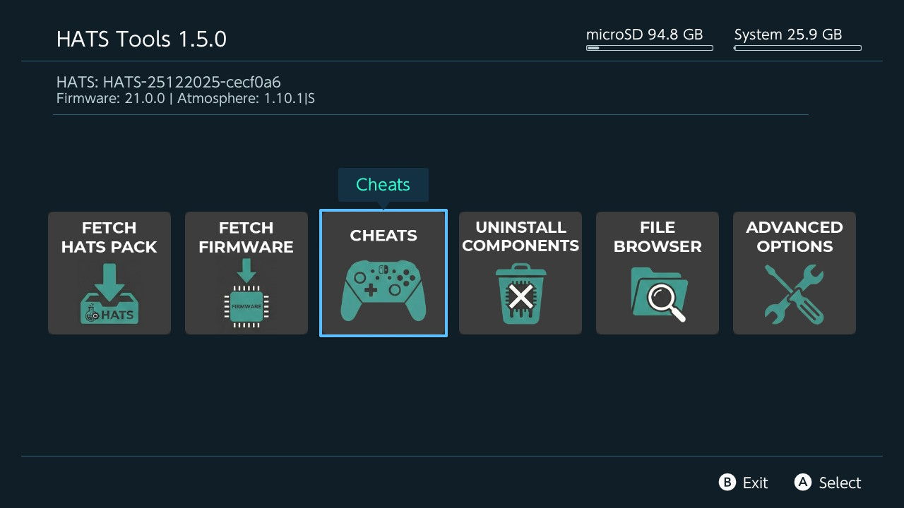

# HATS-Tools

<p align="center">
  
</p>

A tool for the Nintendo Switch that allows you to:

- **Fetch HATS Pack** - Download and install HATS pack releases
- **Fetch Firmware** - Download firmware for installation via Daybreak
- **Uninstall Components** - Remove installed components (except Atmosphere/Hekate)

## Building from source

This project is based on Sphaira code, but stripped down to the essentials.

You will first need to install [devkitPro](https://devkitpro.org/wiki/Getting_Started).

Next you will need to install the dependencies:
```sh
sudo pacman -S switch-dev deko3d switch-cmake switch-curl switch-glm switch-zlib switch-mbedtls
```

Also you need to have on your environment the packages `git`, `make`, `zip` and `cmake`

Once devkitPro and all dependencies are installed, you can now build HATS-Tools.

```sh
git clone https://github.com/sthetix/HATS-Tools.git
cd HATS-Tools
./build_release.sh
```

The output will be found in `out/hats-tools.zip`

## Credits

- [libpulsar](https://github.com/ITotalJustice/switch-libpulsar)
- [nanovg-deko3d](https://github.com/ITotalJustice/nanovg-deko3d)
- [stb](https://github.com/nothings/stb)
- [yyjson](https://github.com/ibireme/yyjson)
- [minIni](https://github.com/ITotalJustice/minIni-nx)
- [libnxtc](https://github.com/ITotalJustice/libnxtc)
- [zstd](https://github.com/facebook/zstd)
- [dr_libs](https://github.com/mackron/dr_libs)
- [id3v2lib](https://github.com/larsbs/id3v2lib)
- [nxdumptool](https://github.com/DarkMatterCore/nxdumptool) (for RSA verify code)
- [nx-hbloader](https://github.com/switchbrew/nx-hbloader)
- Everyone who has contributed to this project!


## Support My Work

If you find this project useful, please consider supporting me by buying me a coffee!

<a href="https://www.buymeacoffee.com/sthetixofficial" target="_blank">
  
</a>
