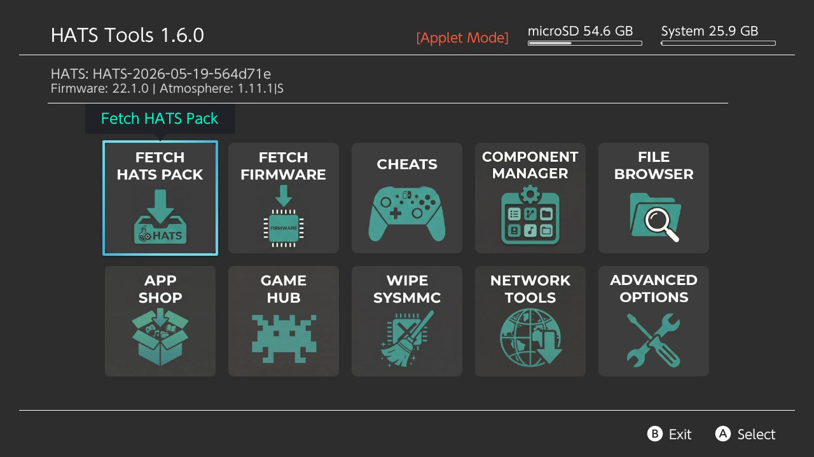

# HATS-Tools

<p align="center">
  
</p>

HATS-Tools is based on [Sphaira](https://github.com/ITotalJustice/sphaira) by [ITotalJustice](https://github.com/ITotalJustice), modified and extended with HATS-focused workflows.

A comprehensive tool for the Nintendo Switch that allows you to:

- **Fetch HATS Pack** - Download and install HATS pack releases
- **Fetch Firmware** - Download firmware for installation via Daybreak
- **Cheats Manager** - Download and manage game cheats from nx-cheats-db and installed cheat files
- **Uninstall Components** - Remove installed components (except Atmosphere/Hekate)
- **File Browser** - Browse, manage, and extract files on your SD card
- **Homebrew App Shop** - Browse, install, and update homebrew apps
- **Game Hub** - Manage installed games, package installs, saves, and game cards
- **Network Tools** - Use GitHub downloads, the web browser, FTP/MTP, and USB install tools
- **Wipe SYSMMC** - Reset SYSMMC (OFW/Stock) with confirmation and countdown protection

## Installation

1. **Download HATS-Tools**: Download the latest `hats-tools.zip` from the [Releases](https://github.com/sthetix/HATS-Tools/releases) page
2. **Extract to SD Card**: Extract the zip file directly to the root of your Nintendo Switch SD card
3. **Download HATS Installer Payload**: For the installer functionality to work, you must also download the HATS Installer Payload from [sthetix/HATS-Installer-Payload](https://github.com/sthetix/HATS-Installer-Payload)
   - Download the payload zip file
   - Extract it to the root of your SD card as well

**Important**: The HATS Installer Payload is required for the installer function to work. Without it, the installation feature will not function properly.

## Features

### HATS Pack and Firmware Downloads
Download HATS pack releases and firmware packages directly from configured GitHub release sources. HATS pack downloads can be staged for the HATS Installer Payload, with install modes for overwrite or replacement-style installs.

### Game Hub
Game Hub groups the restored Sphaira game tools into one place:

- **Installed Games**: Browse and manage installed titles
- **Install NSP/XCI**: Install NSP, XCI, NSZ, and XCZ packages from the file browser
- **Saves**: Backup and restore save data
- **Game Card**: View, install, and export inserted game cards
- **Install Options**: Configure package installation behavior
- **Export Options**: Configure game and game card exports

### Network Tools
Network Tools collects online and transfer workflows:

- **GitHub Downloads**: Download releases from configured GitHub repositories
- **Web Browser**: Open built-in browser shortcuts or enter a custom URL
- **FTP**: Use FTP install and FTP server options
- **MTP**: Use MTP install and responder options
- **USB Install**: Install game packages over USB

### Homebrew App Shop
Browse the homebrew app store from HATS Tools, install new homebrew apps, and update existing apps.

### Cheats Manager
The cheats manager provides a comprehensive solution for managing game cheats on your Switch:

- **nx-cheats-db Source**: Download cheats from the bundled/local nx-cheats-db flow
- **View Installed Cheats**: Browse all games with cheats currently installed on your system
- **Cheat Preview**: Preview cheat codes before downloading them
- **Easy Management**: Delete individual cheat files or view detailed cheat information
- **Automatic Detection**: Automatically detects installed games and their build IDs
- **Fallback Detection**: Uses installed title metadata and build ID fallbacks when direct detection fails

### Wipe SYSMMC
Wipe SYSMMC resets SYSMMC (OFW/Stock) to factory defaults. The flow includes a warning, countdown, cancel option, and reboot attempt after the wipe completes.

**Warning**: This is destructive and cannot be undone. Only use it when you understand exactly what will be wiped.

### Automatic Backup
Before installing a HATS pack, the tool can automatically back up your existing `/atmosphere` and `/bootloader` folders to `/sdbackup/` with timestamps (e.g., `/sdbackup/atmosphere_20231225_143000`). This feature can be toggled in the Advanced Options menu.

### Backup Warning
A red warning popup reminds you to backup your SD card before installation. This reminder can be disabled in Advanced Options if you prefer.

### Customizable Sources
HATS-Tools allows you to customize the source URLs for HATS packs and firmware downloads by editing the configuration file. This is useful if you want to use your own forks or self-hosted releases.

To customize the URLs, edit `/config/hats-tools/config.ini` on your SD card:

```ini
[pack]
# HATS pack source (default: sthetix/HATS releases)
pack_url=https://api.github.com/repos/sthetix/HATS/releases

[installer]
# HATS installer payload location
payload=/switch/hats-tools/hats-installer.bin

# Staging path for HATS extraction
staging_path=/config/hats-tools/hats-staging

# Installation mode (options: overwrite, replace_ams, replace_ams_bl, clean)
# overwrite - Only overwrite files, no deletion (safest, preserves cheats/mods)
# replace_ams - Delete and replace /atmosphere only
# replace_ams_bl - Delete and replace /atmosphere and /bootloader
# clean - Delete and replace /atmosphere, /bootloader, and /switch (fresh install)
install_mode=overwrite

[firmware]
# Firmware source (default: sthetix/NXFW releases)
firmware_url=https://api.github.com/repos/sthetix/NXFW/releases
```

This allows you to:
- Use custom HATS pack releases from your own repository
- Point to alternative firmware sources
- Maintain internal deployments with custom hosts
- Test personal builds without affecting the default configuration

Note: If these settings are not present in your config.ini, the application will use the default official sources automatically.

## Building from source

This project is based on [Sphaira](https://github.com/ITotalJustice/sphaira) by [ITotalJustice](https://github.com/ITotalJustice), with HATS-specific changes and additional tooling.

You will first need to install [devkitPro](https://devkitpro.org/wiki/Getting_Started).

Next you will need to install the dependencies:
```sh
sudo pacman -S switch-dev deko3d switch-cmake switch-curl switch-glm switch-zlib switch-mbedtls
```

Also you need to have on your environment the packages `git`, `make`, `zip` and `cmake`

Once devkitPro and all dependencies are installed, you can now build HATS-Tools.

```sh
git clone https://github.com/sthetix/HATS-Tools.git
cd HATS-Tools
./build_release.sh
```

The output will be found in `out/hats-tools.zip`

## Credits

- [Sphaira](https://github.com/ITotalJustice/sphaira) by [ITotalJustice](https://github.com/ITotalJustice) - original project HATS-Tools is based on
- [libpulsar](https://github.com/ITotalJustice/switch-libpulsar)
- [nanovg-deko3d](https://github.com/ITotalJustice/nanovg-deko3d)
- [stb](https://github.com/nothings/stb)
- [yyjson](https://github.com/ibireme/yyjson)
- [minIni](https://github.com/ITotalJustice/minIni-nx)
- [libnxtc](https://github.com/ITotalJustice/libnxtc)
- [zstd](https://github.com/facebook/zstd)
- [dr_libs](https://github.com/mackron/dr_libs)
- [id3v2lib](https://github.com/larsbs/id3v2lib)
- [nxdumptool](https://github.com/DarkMatterCore/nxdumptool) (for RSA verify code)
- [nx-hbloader](https://github.com/switchbrew/nx-hbloader)
- Everyone who has contributed to this project!


## Support My Work

If you find this project useful, please consider supporting me by buying me a coffee!

<a href="https://www.buymeacoffee.com/sthetixofficial" target="_blank">
  
</a>
